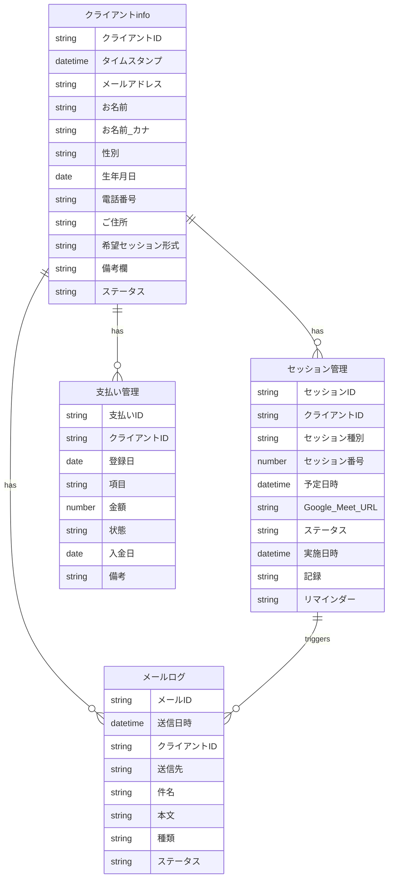

# マインドエンジニアリング・コーチング管理システム - データベース構造

本システムのデータベースはGoogle Sheets上に構築されています。各シートの構造と役割について説明します。

## 1. クライアントinfo シート

クライアントの基本情報を管理するシートです。

| 列 | カラム名 | 説明 | データ型/形式 |
|----|---------|------|-------------|
| A | クライアントID | クライアント固有の識別子 | 文字列 |
| B | タイムスタンプ | 登録日時 | 日時 |
| C | メールアドレス | 連絡先メール | メールアドレス |
| D | お名前 | クライアント氏名 | 文字列 |
| E | お名前　（カナ） | クライアント氏名（カナ） | 文字列 |
| F | 性別 | 性別情報 | 文字列 |
| G | 生年月日 | 生年月日 | 日付 |
| H | 電話番号　（ハイフンなし） | 連絡先電話番号 | 数値/文字列 |
| I | ご住所 | 住所情報 | 文字列 |
| J | 希望セッション形式 | 対面/オンライン等の希望 | 文字列 |
| K | 備考欄 | その他メモ | 文字列 |
| L | ステータス | クライアントの現在の状態 | 文字列 |

### ステータス値の例

- `新規申込` - 申し込み直後の状態
- `トライアル` - トライアルセッション予約済み
- `トライアル済み` - トライアルセッション完了後、継続検討中
- `継続中` - 継続セッション進行中
- `完了` - 全セッション完了
- `キャンセル` - キャンセル・中断

## 2. セッション管理シート

セッションのスケジュールと実施状況を管理するシートです。

| 列 | カラム名 | 説明 | データ型/形式 |
|----|---------|------|-------------|
| A | セッションID | セッション固有の識別子 | 文字列 |
| B | クライアントID | 関連するクライアントID | 文字列（外部キー） |
| C | セッション種別 | トライアル/継続等の種別 | 文字列 |
| D | セッション番号 | 継続セッションにおける回数 | 数値 |
| E | 予定日時 | セッション予定日時 | 日時 |
| F | Google_Meet_URL | オンラインセッション用URL | URL |
| G | ステータス | 予定/完了等の状態 | 文字列 |
| H | 実施日時 | 実際の実施日時 | 日時 |
| I | 記録 | セッションの記録・メモ | 文字列 |
| J | リマインダー | リマインダー送信状態 | 文字列 |

### ステータス値の例

- `予定` - 予約済み、未実施
- `完了` - 実施完了
- `キャンセル` - キャンセル
- `延期` - 日程変更

### リマインダー値の例

- `未送信` - リマインダー未送信
- `送信済み` - リマインダー送信済み

## 3. 支払い管理シート

クライアントの支払い状況を管理するシートです。

| 列 | カラム名 | 説明 | データ型/形式 |
|----|---------|------|-------------|
| A | 支払いID | 支払い固有の識別子 | 文字列 |
| B | クライアントID | 関連するクライアントID | 文字列（外部キー） |
| C | 登録日 | 支払い登録日 | 日付 |
| D | 項目 | 支払い内容（トライアル/継続等） | 文字列 |
| E | 金額 | 支払い金額 | 数値 |
| F | 状態 | 未入金/入金済み等の状態 | 文字列 |
| G | 入金日 | 実際の入金日 | 日付 |
| H | 備考 | その他メモ | 文字列 |

### 状態値の例

- `未入金` - 未入金
- `入金済み` - 入金確認済み
- `確認待ち` - 入金確認中
- `キャンセル` - キャンセル

## 4. メールログシート

送信したメールの履歴を記録するシートです。

| 列 | カラム名 | 説明 | データ型/形式 |
|----|---------|------|-------------|
| A | メールID | メール固有の識別子 | 文字列 |
| B | 送信日時 | メール送信日時 | 日時 |
| C | クライアントID | 送信先クライアントID | 文字列（外部キー） |
| D | 送信先 | 送信先メールアドレス | メールアドレス |
| E | 件名 | メール件名 | 文字列 |
| F | 本文 | メール本文 | 文字列 |
| G | 種類 | リマインダー/確認等の種類 | 文字列 |
| H | ステータス | 送信済み/エラー等の状態 | 文字列 |

### 種類の例

- `トライアル確認` - トライアルセッション予約確認
- `リマインダー` - セッション前日リマインダー
- `フォローアップ` - セッション後フォローアップ
- `支払い案内` - 支払い情報の案内
- `支払い確認` - 支払い確認通知

## 5. 設定シート

システム設定値を管理するシートです。

| 列 | カラム名 | 説明 | データ型/形式 |
|----|---------|------|-------------|
| A | 設定キー | 設定項目のキー | 文字列 |
| B | 設定値 | 設定の値 | 文字列 |
| C | 説明 | 設定の説明 | 文字列 |

### 主な設定値

| 設定キー | 設定値 | 説明 |
|---------|-------|------|
| ADMIN_EMAIL | mindengineeringcoaching@gmail.com | 管理者メール |
| SERVICE_NAME | マインドエンジニアリング・コーチング | サービス名 |
| MAIL_SENDER_NAME | マインドエンジニアリング・コーチング 森山雄太 | 送信者名 |
| CORPORATE_COLOR | #c50502 | コーポレートカラー |
| TRIAL_FEE | 6000 | トライアル料金 |
| CONTINUATION_FEE | 214000 | 継続セッション料金 |
| SESSION_DURATION | 30 | セッション時間（分） |

## 6. メールテンプレートシート

メール送信に使用するテンプレートを管理するシートです。

| 列 | カラム名 | 説明 | データ型/形式 |
|----|---------|------|-------------|
| A | テンプレートID | テンプレート識別子 | 文字列 |
| B | 種類 | メールの種類 | 文字列 |
| C | 件名 | メール件名テンプレート | 文字列 |
| D | 本文 | メール本文テンプレート | 文字列 |

### テンプレート置換タグ

テンプレート内では以下のタグが使用でき、送信時に実際の値に置換されます：

- `{{クライアント名}}` - クライアント名
- `{{セッション日時}}` - セッション予定日時
- `{{セッション形式}}` - オンライン/対面
- `{{Google_Meet_URL}}` - Google MeetのURL
- `{{トライアル料金}}` - トライアルセッション料金
- `{{継続料金}}` - 継続セッション料金
- `{{支払い期限}}` - 支払い期限日
- `{{銀行情報}}` - 振込先銀行情報

## リレーション図

