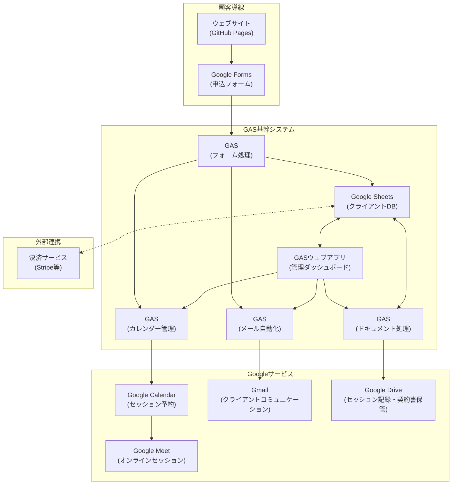
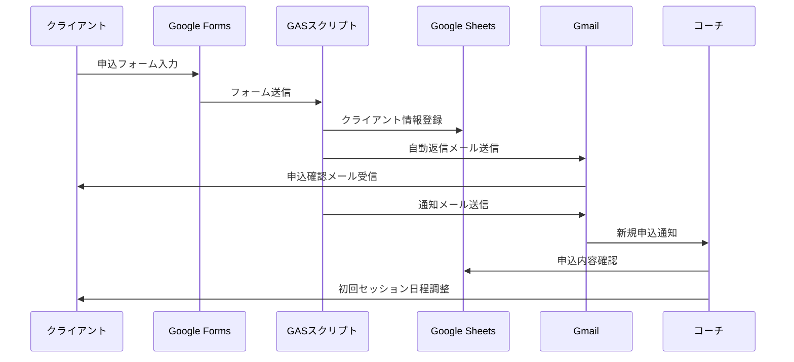
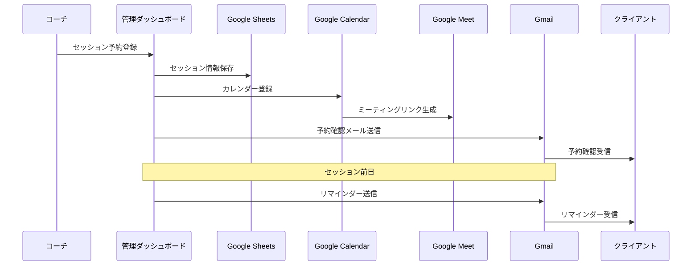

# マインドエンジニアリング・コーチング業務管理システムのアーキテクチャ

このドキュメントでは、マインドエンジニアリング・コーチング業務管理システムのアーキテクチャを説明します。

## システム構成図

## コンポーネント説明

### 顧客導線

1. **ウェブサイト (GitHub Pages)**: マインドエンジニアリング・コーチングの情報提供と申込フォームへの導線
2. **Google Forms (申込フォーム)**: クライアントからの申込情報を収集

### GAS基幹システム

1. **フォーム処理スクリプト**: フォーム送信を処理し、データベースに登録
2. **Google Sheets (クライアントDB)**: クライアント情報、セッション予約、支払い情報を管理
3. **カレンダー管理スクリプト**: Google Calendarとの連携、セッション予約管理
4. **メール自動化スクリプト**: 自動メール送信（リマインダー、フォローアップなど）
5. **ドキュメント処理スクリプト**: 契約書などの文書生成と管理
6. **管理ダッシュボード**: コーチがクライアント管理、セッション予約などを行うためのウェブアプリケーション

### Googleサービス連携

1. **Google Calendar**: セッションのスケジュール管理
2. **Google Meet**: オンラインセッションのビデオ会議
3. **Gmail**: クライアントとのコミュニケーション
4. **Google Drive**: セッション記録と契約書の保管

### 外部サービス連携

1. **決済サービス**: 支払い処理（将来的な拡張）

## データフロー

1. クライアントがウェブサイトを訪問し、申込フォームに記入
2. フォームデータがGASスクリプトによって処理され、Google Sheetsに保存
3. 自動メールがクライアントに送信され、初回トライアルセッションの案内
4. 管理ダッシュボードでコーチがクライアント情報を確認
5. セッション予約が確定すると、Google Calendarに登録され、Google Meetリンクが生成
6. セッション前にリマインダーメールが自動送信
7. セッション実施後、コーチが記録を入力し、次回セッションのフォローアップ

## 主要処理のワークフロー

### 新規クライアント登録プロセス

### セッション予約・リマインダープロセス

## データベース構造

Google Sheetsを使用したデータベース構造については、`database-structure.md`ファイルを参照してください。